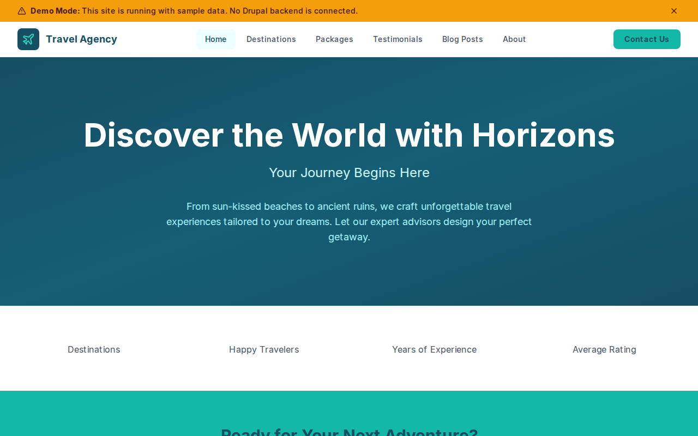

# Decoupled Travel Agency

A travel agency website starter for Decoupled Drupal + Next.js. Built for travel agencies, tour operators, and travel consultancies to showcase destinations, sell travel packages, and share travel content.



## Features

- **Destinations** - Showcase travel destinations with highlights, best travel seasons, and regional filtering
- **Travel Packages** - Curated packages with pricing, duration, inclusions, and itinerary details
- **Testimonials** - Customer reviews with ratings, traveler photos, and trip details
- **Travel Blog** - Travel tips, destination guides, food and culture stories with categories
- **Modern Design** - Clean, inviting UI with a teal and cyan color palette that evokes ocean and sky

## Quick Start

### 1. Clone the template

```bash
npx degit nickstoneman/decoupled-travel-agency my-travel-agency
cd my-travel-agency
npm install
```

### 2. Run interactive setup

```bash
npm run setup
```

This interactive script will:
- Authenticate with Decoupled.io (opens browser)
- Create a new Drupal space
- Wait for provisioning (~90 seconds)
- Configure your `.env.local` file
- Import sample content

### 3. Start development

```bash
npm run dev
```

Visit [http://localhost:3000](http://localhost:3000)

---

## Manual Setup

If you prefer to run each step manually:

<details>
<summary>Click to expand manual setup steps</summary>

### Authenticate with Decoupled.io

```bash
npx decoupled-cli@latest auth login
```

### Create a Drupal space

```bash
npx decoupled-cli@latest spaces create "My Travel Agency"
```

Note the space ID returned (e.g., `Space ID: 1234`). Wait ~90 seconds for provisioning.

### Configure environment

```bash
npx decoupled-cli@latest spaces env 1234 --write .env.local
```

### Import content

```bash
npm run setup-content
```

This imports:
- Homepage with hero, statistics, and call-to-action sections
- 4 Destinations (Santorini, Kyoto, Marrakech, Patagonia)
- 3 Travel Packages (Greek Island Hopping, Japan Cultural Immersion, Morocco Desert Adventure)
- 3 Testimonials (Sarah Mitchell, James Chen, Elena Rodriguez)
- 3 Blog Posts (Packing Guide, Budget Europe, Asian Food Guide)
- 2 Static Pages (About, Contact)

</details>

## Content Types

### Destination
- Title, Body (description and things to do)
- Region (taxonomy), Country
- Highlights (string list)
- Best Time to Visit
- Destination Image, Featured flag

### Travel Package
- Title, Body (itinerary and details)
- Price, Duration
- Package Type (taxonomy: Adventure, Luxury, Family, Honeymoon, Cultural, Beach, Cruise)
- Inclusions (string list)
- Package Image, Featured flag

### Testimonial
- Title (trip headline), Body (review text)
- Traveler Name, Trip Destination
- Rating, Travel Date
- Traveler Photo

### Blog Post
- Title, Body (article content)
- Featured Image
- Category (taxonomy: Travel Tips, Destination Guides, Packing, Budget Travel, Food & Culture)
- Author Name

## Customization

### Colors & Branding
Edit `tailwind.config.js` to customize colors, fonts, and spacing. The default palette uses teal/cyan tones.

### Content Structure
Modify `data/travel-agency-content.json` to add or change content types and sample content.

### Components
React components are in `app/components/`. Update them to match your agency's brand and design.

## Demo Mode

Demo mode allows you to showcase the application without connecting to a Drupal backend. It displays mock content for the homepage, destinations, packages, testimonials, and blog posts.

### Enable Demo Mode

Set the environment variable:

```bash
NEXT_PUBLIC_DEMO_MODE=true
```

Or add to `.env.local`:
```
NEXT_PUBLIC_DEMO_MODE=true
```

### What Demo Mode Does

- Shows a "Demo Mode" banner at the top of the page
- Returns mock data for all GraphQL queries
- Displays sample destinations, packages, testimonials, and blog posts
- No Drupal backend required

### Removing Demo Mode

To convert to a production app with real data:

1. Delete `lib/demo-mode.ts`
2. Delete `data/mock/` directory
3. Delete `app/components/DemoModeBanner.tsx`
4. Remove `DemoModeBanner` from `app/layout.tsx`
5. Remove demo mode checks from `app/api/graphql/route.ts`

## Deployment

### Vercel (Recommended)
[](https://vercel.com/new/clone?repository-url=https://github.com/nickstoneman/decoupled-travel-agency)

Set `NEXT_PUBLIC_DEMO_MODE=true` in Vercel environment variables for a demo deployment.

### Other Platforms
Works with any Node.js hosting platform that supports Next.js.

## Documentation

- [Decoupled.io Docs](https://www.decoupled.io/docs)
- [Next.js Documentation](https://nextjs.org/docs)
- [Drupal GraphQL](https://www.decoupled.io/docs/graphql)

## License

MIT
